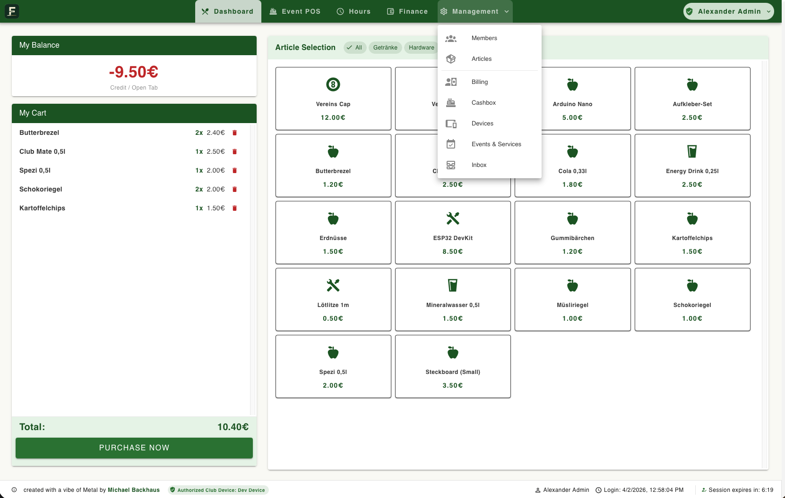

# FRAME - Financials, Records, Activity, and Member Expenses

> [!CAUTION]
> **Disclaimer:** This project is "Vibe coded" (AI-assisted development) and has NOT yet been fully manually checked for errors or security vulnerabilities. It is in a prototype stage – **use at your own risk!**

FRAME is a modern, open-source club management system designed for sports clubs and associations. It streamlines administrative tasks, financial tracking, and member engagement through a clean, intuitive interface.

**Initially conceptualized for a Snooker Club**, the project's name (referencing a 'frame' in play) and signature green aesthetic are a tribute to its origins, though the platform is fully adaptable for associations of any kind.



## 🚀 Key Features

- **Member Management**: Track member details, historical consumption, and membership status.
- **Financial Module (Accounting)**:
  - **Abrechnungen (Billing)**: Digital invoicing system with SEPA export (XML) for banking and integrated PayPal history.
  - **Barkasse (Cashbox)**: Dedicated physical cash management for guest payments and internal receipts (Eigenbelege).
  - **Master Ledger**: Consolidated, exportable logbook of all club transactions for full transparency.
- **Point of Sale (POS)**: Modern cash register interface with article images, member tabs, and automatic **PDF receipt generation** for guests.
- **Working Hours Tracking**: Manage and verify member volunteer hours and event assignments with a visual progress tracker.
- **Change Requests**: Integrated system for members to request data updates, ensuring GDPR compliance.
- **Security & RBAC**: Advanced Role-Based Access Control (VORSTAND, MITARBEITER, SCHATZMEISTER, MEMBER).
- **Session Management**: Dynamic **Sliding Sessions** with proactive background refresh and real-time countdown UI.
- **Privacy First**: Self-hosted architecture with full data control and built-in PII redaction for staff.

## 🛠 Tech Stack

- **Frontend**: Vue.js 3, Vuetify 3 (Material Design), Pinia (State Management), Vite.
- **Backend**: NestJS (Node.js), Prisma ORM, **PDFKit** for receipt/invoice generation.
- **Database**: PostgreSQL.
- **Security**: JWT Authentication (with Refresh Tokens), Secure Device Authorization, bcrypt hashing, SHA-256 for RFID tokens.

## 📦 Setting Up

### Prerequisites
- Node.js (v20+)
- PostgreSQL
- RFID Hardware (optional, for the POS segment)

### Installation

1. **Clone the repository**:
   ```bash
   git clone https://github.com/bughaus/frame.git
   cd frame
   ```

2. **Configure Backend**:
   - Navigate to `backend/`
   - Copy `.env.example` to `.env` and configure your database URL.
   - Install dependencies: `npm install`
   - Push schema to DB: `npx prisma db push`
   - Seed initial data: `npx prisma db seed`

3. **Configure Frontend**:
   - Navigate to `frontend/`
   - Install dependencies: `npm install`

4. **Run the Application**:
   - Backend: `cd backend && npm run start:dev`
   - Frontend: `cd frontend && npm run dev`

## ⚖️ License

Distributed under the **GPL-3.0 License**. See `LICENSE` (to be added) for more information.

## 👥 Authors

- **Michael Backhaus** - [GitHub](https://github.com/bughaus)

---
*Created with a vibe of Metal.*
